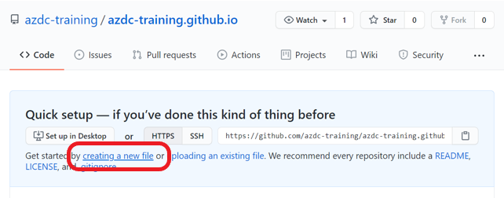
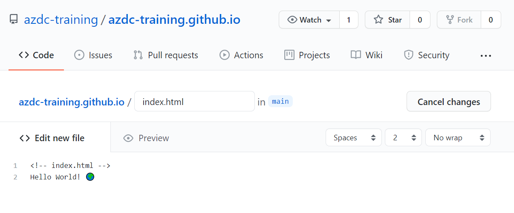
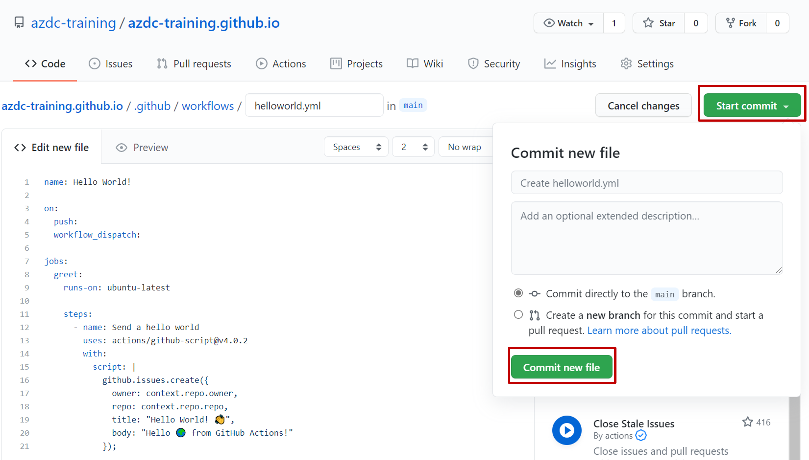
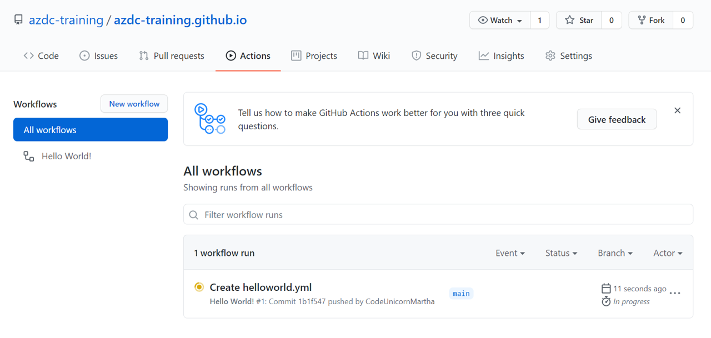
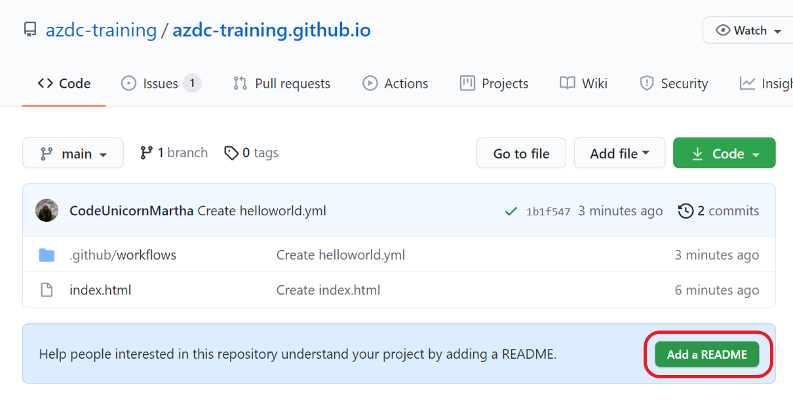
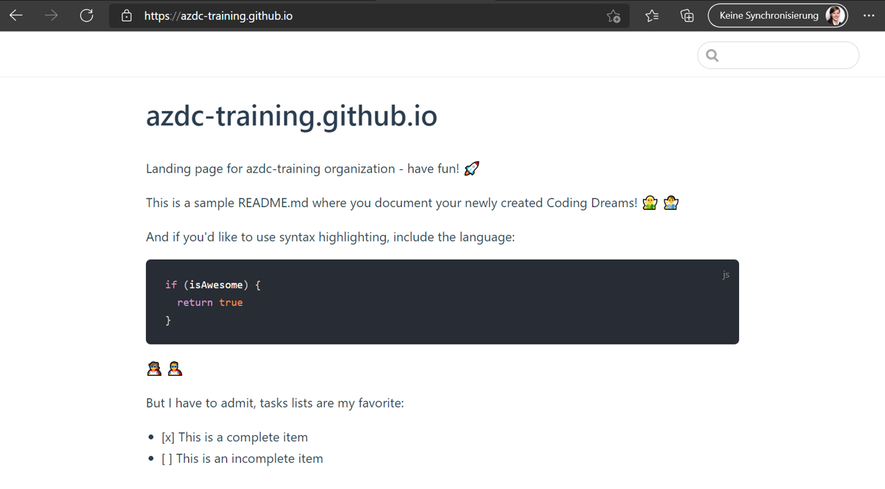

# Challenge: 02 GitHub Actions in Action

⏲️ _est. time to complete: 30 min._ ⏲️

## Here is what you will learn 🎯

In this challenge you will learn:

- how github pages serves static content from you repositories
- how to create a first github action
- how the github script action can help you do workflow automation
- how to use github actions to run a static site generator

## Table of contents

1. [Getting started](#getting-started)
2. [A clean slate - GitHub Pages](#a-clean-slate----github-pages)
3. [Create a new repository](#create-a-new-repository)
4. [Create a Hello World on Github Pages](#create-a-hello-world-on-github-pages)
5. [Action](#action)
6. [What we've learned](#what-weve-learned)
7. [Further reading](#further-reading)
   
## Getting started

In this challenge we will take a first look at GitHub Actions. GitHub Actions is
GitHubs built in workflow automation and CI/CD tool.

In this challenges we will start playing around with Actions and in doing so
create a GitHub user profile page with automated deployment.

Let's get started! 💪👩

## A clean slate 🧻 - GitHub Pages

For this challenge we will again work on an empty repository so nothing comes in
the way of our automation attempts. Before you create this repository, please read
this section about repository naming in relation to GitHub Pages.

We also want to give you a quick tour on GitHub Pages. This feature allows you
to host static websites directly on GitHub, making for a great place to
host your documentation for your project together with it's source code.

GitHub Pages are hosted dependent on the repository name.

After enabling the feature, your page is available under the following link by default:

`https://<username or organization name>.github.io/<repository name`

For each organization and user there is one _special_ repository name `<username or organization name>.github.io` reserved to host the root level GitHub Page
`https://<username or organization name>.github.io/` for you account or
organization.

Let's try this now!

:::tip 📝
As an added bonus you can use this challenge to create a profile,
portfolio or documentation page for your organization or personal github
account.
:::

## Create a new repository

Create a new **public** repository on your organizational account for todays exercises, but be careful when naming this repository.

See an example for naming your repository here:


This allows you to later access this site using your organizations name like this:

`https://<username or organizationname>.github.io`

Make sure you create a public repository and leave it empty for now.

:::tip
📝 If you do _not_ want to create a profile page or have one already just
create a new repository with a different name. You will have to enable GitHub
Pages on your repository manually though.
:::

### Create a Hello World on Github Pages

For anything to show up on your GitHub Page you have to create an `index.html`
file on the `main` branch. So let's do just that!

You can create a new file directly on the GitHub website:



Let's insert some fancy "hello world" HTML:

```html
<!-- index.html -->
<h1>Hello World! 🌍</h1>
```



And save the file using the commit changes dialog at the bottom of the
editor window.

Seconds later your profile page will be visible on:

`https://<username or organizationname>.github.io`

:::tip
📝 If you created a repository with a different name you have to enable
GitHub Pages under your repositories `Settings > Pages` menu.
:::

Your page should look something like this:


For now we've learned about GitHub Pages and how we can use them to serve simple
static content on the default `github.io` domain. In your repositories settings
you can enable custom domains. Custom domains allow you to serve your site from
a domain other than `github.io`.

Although the static content might seem limiting, GitHub Pages can host complex
Javascript Static WebApps. Pages are an excellent way to host documentations for
your projects and the Azure developer college itself uses GitHub Pages to serve
you this tutorial content.

Another interesting project you might want to look at is
[netlify cms](https://www.netlifycms.org/). By using GitHubs own API Netlify
enables you to use your repository as a backend for a fully featured content
management system.

## Action

But where is the **Action** in all this, you might ask yourself. Worry not, we
are getting started.

Now we will write our first "Hello World" style GitHub Action workflow and once
we get the basics of it we will take a look how we could combine GitHub Actions
with GitHub Pages to generate and serve beautiful websites.

### Workflows

GitHub Actions are written and run in so called Workflows. A GitHub Actions
Workflow is a single `.yaml` file in your repositories `.github/workflows/`
folder.

First let's setup a new `hello-world` workflow by navigating to `Actions` and
using the `set up a workflow yourself` option.


Take a good look at the provided example as it has comments every line for you
to orient yourself if the syntax for workflows is new to you.

:::tip

📝
If you are all new to `yaml` please take a look at the [further
reading](#further-reading) section at the end of this page.
:::

Now let's replace the content of the workflow file with the Hello World
workflow, provided in the listing below.

```yaml
# hello-world.yaml
name: Hello World!

on:
  push:
  workflow_dispatch:

jobs:
  greet:
    runs-on: ubuntu-latest

    steps:
      - run: echo "🎉 The job was automatically triggered by a ${{ github.event_name }} event."
      - run: echo "🐧 This job is now running on a ${{ runner.os }} server hosted by GitHub!"
      - run: echo "🔎 The name of your branch is ${{ github.ref }} and your repository is ${{ github.repository }}."
      - name: Send a hello world
        uses: actions/github-script@v4.0.2
        with:
          script: |
            github.issues.create({
              owner: context.repo.owner,
              repo: context.repo.repo,
              title: "Hello World! 👋",
              body: "Hello 🌍 from GitHub Actions!"
            });
```

Let's take a close look at the most important parts and keywords of this first
workflow.

#### name - Workflow

The name of your workflow. GitHub displays the names of your workflows on your
repository's actions page.

#### on - Event

The `on` keywords is required and allows you to specify the kind of _events_
your workflow file is executed **on**.

Some of the most used events are:

- **push**: triggered when a new commit is pushed to your repository.
- **pull_request**: triggered when a pull request is opened in your repository.
- **release**: triggered when a new release tag was created on your repository.
- **workflow_dispatch**: triggered when a user manually starts the workflow
  on the GitHub website.
- **repository_dispatch**: to allow custom webhooks to trigger your workflow.
- **schedule**: for recurring task to run on a schedule.

You can configure your workflows to run when specific activity on GitHub
happens, at a scheduled time, or when an event outside of GitHub occurs.

For more information and a detailed explanation of [events that trigger
workflows](https://docs.github.com/en/actions/reference/events-that-trigger-workflows)
please refer to the GitHub documentation.

#### jobs

A workflow run is made up of one or more jobs. Jobs run in parallel by default.
To run jobs sequentially, you can define dependencies on other jobs using the
`jobs.<job_id>.needs` keyword.

Jobs require the `runs-on` keyword, to tell the pipeline on which kind of machine
"runner" to execute the job.

You can run an unlimited number of jobs as long as you are within the workflow
usage limits.

In our example we have just one job with the `job_id` _greet_, but we could have
multiple jobs for _build_, _test_ and _deploy_ tasks.

```yaml
jobs:
  build: ...
  test:
    needs: [build]
    ...
  deploy:
    needs: [build, test]
    ...
```

#### steps

A job contains a sequence of tasks called steps. Steps can run commands, run
setup tasks, or run an action in your repository, a public repository, or an
action published in a Docker registry. Not all steps run actions, but all
actions run as a step. Each step runs in its own process in the runner
environment and has access to the workspace and filesystem. Because steps run in
their own process, changes to environment variables are not preserved between
steps.

In our example we have to kinds of steps:

```yaml
steps:
  - run: ...
  - uses: actions/...
```

The `run` steps directly execute in the shell of the jobs runner.

The steps with the `uses` keyword refer to an Action which can perform more
complex tasks.

#### Actions

The most powerful feature of GitHub Actions are the Actions themselves. There is
a large collection of predefined GitHub Actions on GitHubs own
[marketplace](https://github.com/marketplace?type=actions).

Take a look at the marketplace and search for `Azure` actions. You will see that
there is already a variety of convenience functions pre-built to be used in your
own workflows. Anytime you write a new workflow file, this is the first place to
take a look if there is already something that you could use.

[GitHubs own Actions](https://github.com/actions) can be found in the _actions_
org on GitHub.

Please be careful when using Actions from unverified sources or any third party
that you don't trust, since these Actions are usually executed in the context of
your own repository.

For your repository and your organizations under `Settings > Actions` you can
configure policies that allow or prevent 3rd party actions from being run inside
your workflows. You can also restrict the kind of permission that workflows have
by default on your repository.

In our sample we use the [GitHub Script
Action](https://github.com/actions/github-script) to have a simple interface for
interacting with GitHubs own APIs. This Action can be used to do some amazing
workflow automation.

#### Context and expression syntax

::: v-pre

In the first three steps of our sample workflow we use some the expression
syntax `${{ expression accessing the context }}` to access the context of our
workflow.

:::

The expression syntax allow you to access context information for your workflow
like:

- environment variables
- secrets stored for your workflows
- details about the event and user that triggered the workflow
- information about your repository and organization

### Committing the workflow file

Now that we've discussed the basics of workflows and this sample let's commit
the file directly to our `main` branch.



This should immediately start our workflow since we declared the `on: push`
event as a trigger for the workflow.

Take a look if you can spot the running Action an drill down into logs the
current workflow run.



Once the workflow is executed successfully you will see a new `Hello World Issue` under the `Issues`
section.


## Run a static site generator in your workflow

Now we will combine what we have learned about Pages and Actions to create a
workflow that takes the markdown files in our repository, generates a static
html website and deploys it directly to our GitHub Page.

Since our repository does not even have a minimal `README.md` file at the moment
let's create one. GitHub should show you an `Add a README` button right on your
projects landing page.



Write you own `README` or copy over the sample we've provided here. This
`README` will be the basis for your website content we will generate using
[VuePress](https://vuepress.vuejs.org/).

The sample shows some of the basics you can do with Markdown. Markdown uses a
simple plain text system to be rendered to semantic HTML.

:::tip

📝
Note that GitHub renders the `README.md` using [GitHub Flavored
Markdown](https://github.github.com/gfm/) to display a landing page for your
project whereas [VuePress](https://vuepress.vuejs.org/) uses
[markdown-it](https://github.com/markdown-it/markdown-it) to render the Markdown
into HTML.

:::

````md
# azdc-training.github.io

Landing page for azdc-training organization - have fun! 🚀

This is a sample README.md where you document your newly created Coding Dreams! 🧚‍♀️ 🧚‍♂️

And if you'd like to use syntax highlighting, include the language:

```javascript
if (isAwesome) {
  return true
}
```

🦸‍♀️ 🦸‍♂️

But I have to admit, tasks lists are my favorite:

- [x] This is a complete item
- [ ] This is an incomplete item

Don't forget to add images:


and [Links](https://en.wikipedia.org/wiki/Doge_(meme)
````

### Setting up the workflow

This time we will start to write a little more complex workflow that will do the
following:

- when pushing to the `main` branch
- or when creating a Pull Request to the `main` branch

- run a `build` job that

  - checks out the source code
  - sets up nodejs
  - runs the `vuepress build` using `npx`
  - stores the result as an artifact

- and a `deploy` job

  - that only runs on the `main` branch
  - downloads the stored artifact
  - deploys the content of the artifact on the `gh-pages` branch in the same repository

:::warning

To see that the deploy job only runs on the main branch commit the workflow file
on a separate branch and open a new Pull Request.

:::

```yml
name: pages

on:
  push:
    branches:
      - main
  pull_request:
    branches:
      - main

jobs:
  build:
    runs-on: ubuntu-latest

    steps:
      - name: Checkout
        uses: actions/checkout@v2

      - uses: actions/setup-node@v2.1.5
        with:
          node-version: '12'

      - run: npx vuepress build
      - name: Upload result of vuepress build
        uses: actions/upload-artifact@v2
        with:
          name: static-website
          path: .vuepress/dist

  deploy:
    runs-on: ubuntu-latest
    needs: build

    if: ${{ github.ref == 'refs/heads/main' }}

    steps:
      - name: Download build of static website
        uses: actions/download-artifact@v2
        with:
          name: static-website
          path: .vuepress/dist
      - name: Deploy to GitHub Pages
        uses: crazy-max/ghaction-github-pages@v2
        with:
          build_dir: .vuepress/dist
        env:
          GITHUB_TOKEN: ${{ secrets.GITHUB_TOKEN }}
```

Once we approve the Pull Request both jobs should execute and you should see a
new branch named `gh-pages` on your repository.

Your GitHub Page still serves the default `main` branch so for you to actually
see the hosted website change you need to go to your repositories `Settings > Pages`
site, change the branch used to serve the Page and save.


Now your website should update and show the content of the `README.md` rendered
using VuePress.



## What we've learned

We've taken a tour of two important features of GitHub. We've seen GitHub
Actions being able to build, test and deploy a simple website and having the
ability to do workflow scripting using GitHubs own APIs.

And we've discovered GitHub Pages and used them as a deployment target for our
first CI/CD pipeline creating a static website.

## Further reading

- [Introduction to YAML](https://dev.to/paulasantamaria/introduction-to-yaml-125f)
- [VuePress](https://vuepress.vuejs.org/)
- [Netlify CMS](https://www.netlifycms.org/)


[◀ Previous challenge](./01-challenge-boards.md) | [🔼 Day 4](../README.md) | [Next challenge ▶](./03-challenge-bicep.md)